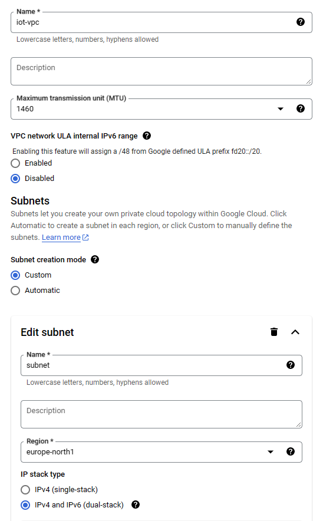
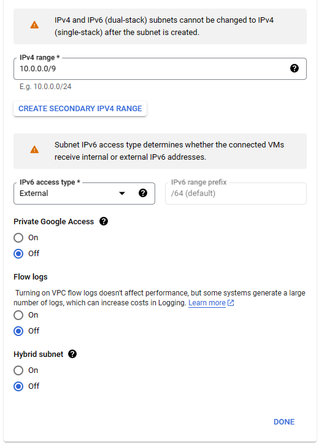
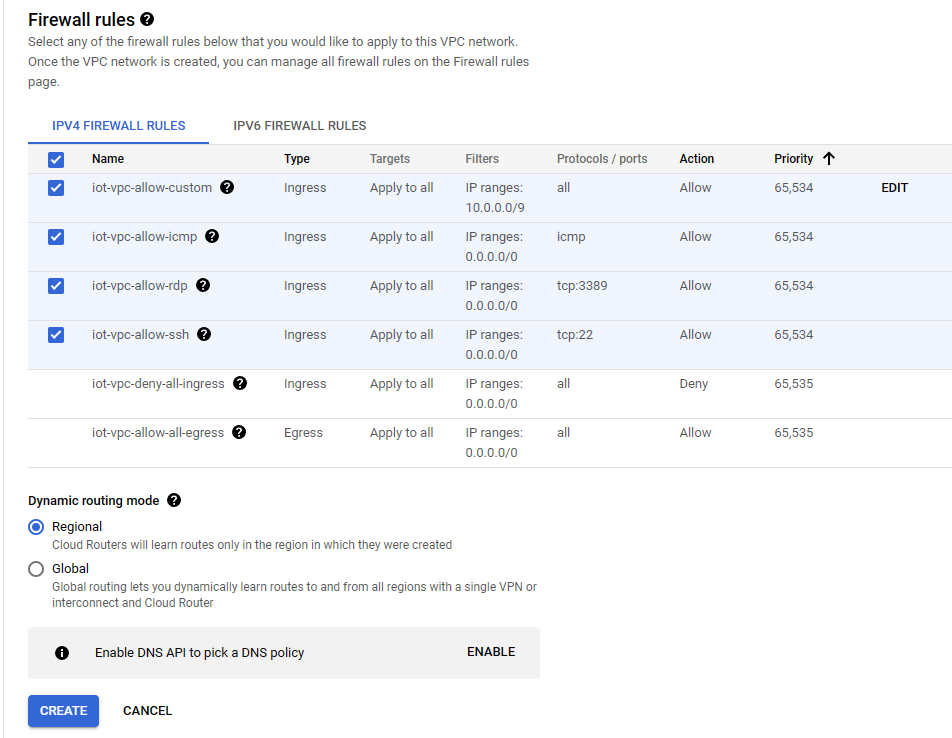
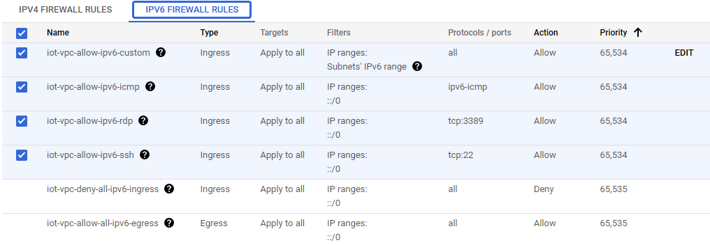
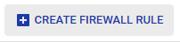
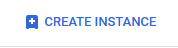
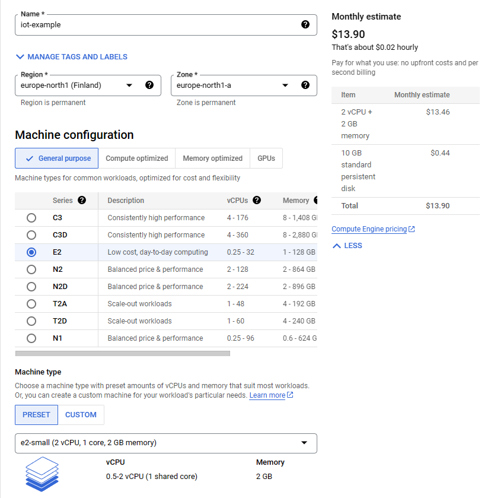
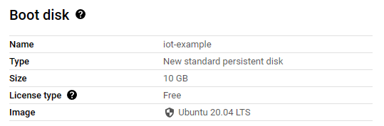
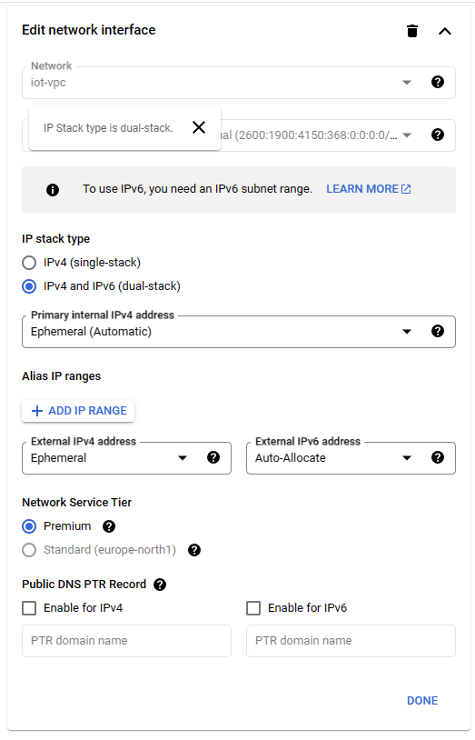
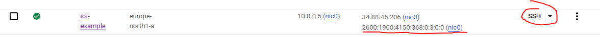

# IoT-miniproject-2-Coap-Server

**IoT-miniproject-2-Coap-Server** is the part of the project work, [miniproject 2](https://github.com/matluuk/IoT-miniproject-2), assigned at the Internet of Things (521043S-3004) course at University of Oulu in 2023. The base for this CoAp server is taken from tha same courses [miniproject 1 implementation](https://github.com/matluuk/IoT-miniproject-1.git). 

## Overview

The repository consists of two parts: backend and frontend. 

Backend implements a CoAp server, which communicates wit the location tracker. The server has two tasks. Firstly it handles the received location data. Saves it to a sql database and sends it to the frontend, when requested. Secondly it handles the device config. The location tracker can request device config from the server and the frontend can modify the device config.

Frontend is the user interface for the location tracker. The interface is a simple website, where the location data is shown on the map and device config can be modified.

### Table of Contents

- [Create linux virtual machine](#create-linux-virtual-machine)
    - [Set up Google cloud VM](#set-up-google-cloud-vm)
    - [Create Virtual private cloud](#create-virtual-private-cloud)
    - [Firewall rules](#firewall-rules)
    - [Create VM instance](#create-vm-instance)
- [Backend](#backend)
    - [Start backend](#start-backend)
    - [LOGS](#logs)
    - [SQL database](#sql-database)
    - [Backend unittests](#backend-unittests)
- [Frontend](#frontend)

- [Code Structure](#code-structure)
- [Authors](#authors)

## Create linux virtual machine

For CoAp server a linux virtual machine is needed. Any linux virtual machine should work, but we walk through how to set up Google Cloud virtual machine. Google cloud has a free trial with 300$ credits to use. The virtual machine needs a external IPV6 ip address for connection with the iot-lab node. 

Requirements for the virtual machine:
- runs linux, preferably Ubuntu 20.04
- external IPV4 address
- port 5683 (CoAp backend) open for udp
- ports 5000 (flask app) and 8000 (http website) open for tcp
- SSH connection to the VM

### Set up Google cloud VM

Google Cloud account is needed for using google Cloud services. At the time being, 300 credits can be obtained for use in 3 months time period for free. Below are a link to where a google cloud account can be created.

https://console.cloud.google.com/?hl=en&_ga=2.87814171.-2055644655.1699615458&_gac=1.116033140.1702051941.CjwKCAiAmsurBhBvEiwA6e-WPIQOg4lsX1QJevny4vxo9FBotFtCxOCFgTHR5MXrhSOSkf66HEamdRoCthsQAvD_BwE

### Create Virtual private cloud

I strongly advise to create a VPC (virtual private cloud) for the VM, as it allows the external ipv6 addresses for the VM. The default vpc could be also used, as ecternal IPv6 address is not necessary for this project. The VPC:s can be managed at following google cloud console site.

https://console.cloud.google.com/networking/networks?hl=en&_ga=2.16771894.-1464318792.1699625730&_gac=1.195093086.1701470264.CjwKCAiApaarBhB7EiwAYiMwqnFJQWu6iGIMccKLYWIfXNoxHQGC0UXqAEzLXMDN3NWpUHO9M_Fa9RoC834QAvD_BwE

VPC can be created by pressing the `CREATE VPC NETWORK` button on the top bar.


Below are all the setting I used to create the VPC.

<details><summary>VPC settings</summary>





Select all these firewall rules for both ipv4 and ipv6!





</details>

### Firewall rules

Firewall rules are a set of instructions that control how a firewall device handles incoming and outgoing traffic. They are access control mechanisms that enforce security in networks by blocking or allowing communication based on predetermined criteria. 

Firewall rules can be managed at Google Cloud firewall rules website: 

https://console.cloud.google.com/net-security/firewall-manager/firewall-policies

For the backend coap server, a firewall rule that allows udp traffic on CoAp port 5683 must be created.

For frontend html site tcp traffic must be allowed on port 8000.

For flask app, tcp traffic must be allowed on port 5000.

Firewall rules can be created by clicking the `CREATE FIREWALL RULE` buttons: 



### Create VM instance

The Virtual machine is used to deploy the Coap server. Google cloud VM:s can be managed from the Google Cloud console instances website.

https://console.cloud.google.com/compute/instances

Click the `CREATE INSTANCE` button. And change the settings mentioned on the dropdown below.



<details><summary>VM instance settings</summary>

Notice! It is important that the VM region is the same as the VPC subnet region.
For the machine type I have chosen the e2-small. This have been enough for the CoAp server.



The linux image should be changed to Ubuntu 20.04 under `Boot Disk`



Under Advanced options the Networking settings must be changed. 

1. Change the Network interface from default to the newly created VPC. 
2. The subnetwork should be automatically selected to the one that you created.
3. Select the `IP stack type` to be IPv4 and IPv6 (dual-stack)


</details>

Now everything should be properly set up and the VM instance can be created. The instance should dispaly the external ipv6 address.



The SSH connection to the VM instance can be made by clicking the SSH button under Connect. This creates new window with the ssh connection.


## Set up the CoAP server

Connect to the linux VM, where you want the the CoAp server to be deployed.

### Install all the dependencies and set up the python3 virtual environment.

1. Clone the repository to your folder of choise:

    ```bash
    git clone https://github.com/matluuk/IoT-miniproject-2-Coap-Server.git
    ```

2. move to the repository folder
    ```bash
    cd IoT-miniproject-2-Coap-Server/
    ```

3. update apt-get
    ```bash
    sudo apt-get update
    ```

4. Create python venv (backend and frontend)

    * install python3.8-venv
        ```bash
        sudo apt install python3.8-venv -y
        ```

    * Create the python venv 
    
        Notice - Use the start_server.sh script activates the venv automatically, so use exactly the same venv location and name or modify the start_server.sh

        ```bash
        python3 -m venv ./venv
        ```

    * Activate the python venv
        ```bash
        source ./venv/bin/activate
        ```

5. install aiocoap (backend)

    First all dependencies have to be installed:

    * install autoconf on linux 

        ```bash
        sudo apt-get install autoconf -y
        ```

    * install python-dev for 

        ```bash
        sudo apt-get install python-dev-is-python3 -y
        ```

    * install build-essential

        ```bash
        sudo apt-get install build-essential -y
        ```

    * Finally install aiocoap to the activated python venv

        ```bash
        pip3 install --upgrade "aiocoap[all]"
        ```

6. Install flask (frontend)
    * install flask
        ```bash
        pip3 install flask
        ```
    * install flask-cors
        ```bash
        pip3 install flask-cors
        ```

## Backend


### Start backend

1. Check the external ipv4 address for your VM. For google cloud VM it can be found on the **VM instances** tab

2. Start the CoAp server using your external ipv4 address and port 5683
    ```bash
    sh start_server.sh ip=<external-ipv4-address-of-the-VM> port=5683
    ```

The `start_server.sh` uses nohup to start the server. Press `enter` to go back to console. 

Server are now running on the background and can be stopped using the `stop_server.sh` script.
```bash
sh stop_server.sh
```
### LOGS

The CoAp server saves logs of every session to `logs` folder. To take a look on the log created. 
1. Go to the `logs` folder:
    ```bash
    cd logs
    ```

2. The `tail` command can be used to show the logs in real time.
    ```bash
    tail -f ./<name-of-the-lates-log-file>.log
    ```

### SQL database

The name of the used sql database is **sqlite_database.db**

### Backend unittests

Some unittest for the CoAp server backend are implemented. To run the unittests pytest is used. For some test_server unittests the server needs to be started manually to localhost.


## Frontend


## Code Structure

// TODO:

The project has the following code structure:

```plaintext
.
├── server.py
├── start_server.sh
├── stop_server.sh
├── images
│   └── ...
└── README.md
```

## Authors

- **Matti Luukkonen** - [GitHub Profile](https://github.com/matluuk)